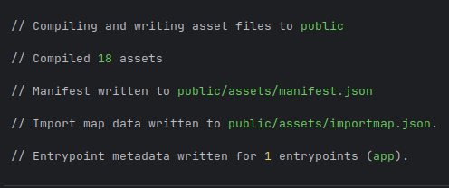
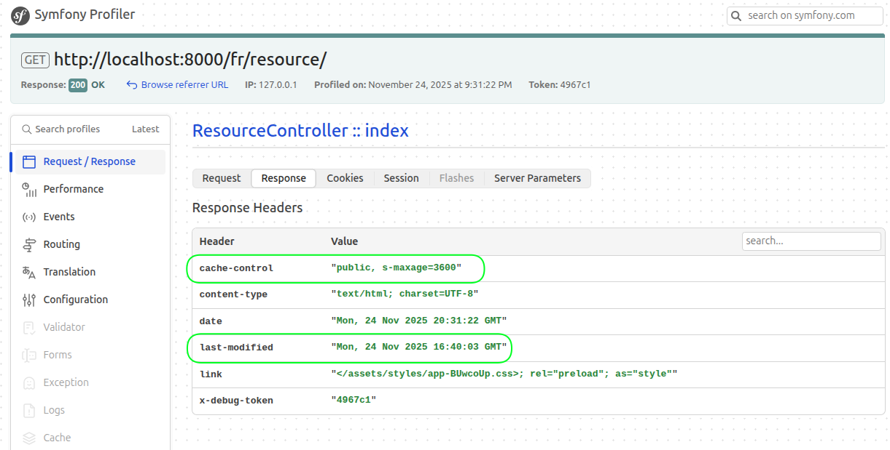
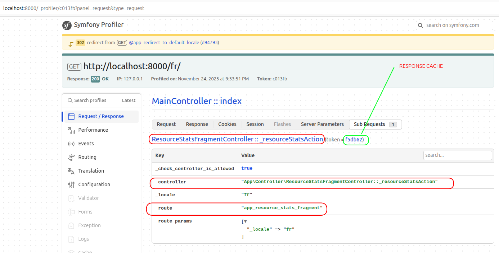
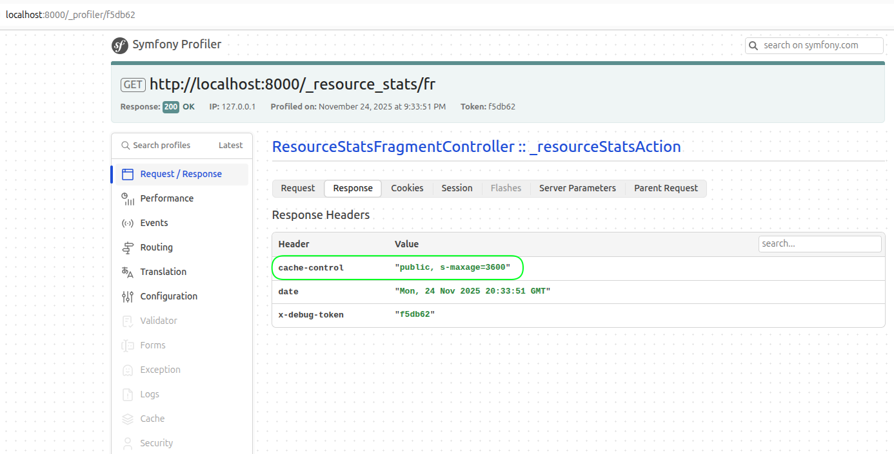

# Guide Technique : Optimisation des Performances avec Cache HTTP et ESI

Ce document détaille l'implémentation de deux stratégies de cache HTTP dans le projet ResaLab pour améliorer les temps de réponse : le cache de page complète et le cache de fragments via ESI (Edge Side Includes). Il couvre également la configuration nécessaire pour l'analyse en production et la résolution des problèmes courants rencontrés.

---

### 1. Lexique des Termes Clés

#### Cache HTTP (HyperText Transfer Protocol Cache)
Mécanisme permettant aux navigateurs ou à des serveurs intermédiaires (proxys) de stocker des copies de ressources pour réduire le temps de chargement et la charge serveur.

*   **Cache d'Expiration (`Cache-Control`, `Expires`) :** Le serveur indique une durée de validité pour une ressource.
    *   `public` : Peut être mis en cache par tous (navigateurs, proxys).
    *   `private` : Ne peut être mis en cache que par le client final (navigateur).
    *   `max-age=X` : Durée de validité en secondes pour le client.
    *   `s-maxage=X` : Durée de validité en secondes pour les proxys partagés.
*   **Cache de Validation (`Last-Modified`, `ETag`) :** Le client demande au serveur si la ressource a changé. Si non, le serveur répond `304 Not Modified`, et le client utilise sa version locale.

#### ESI (Edge Side Includes)
Langage de balisage permettant de définir des "trous" dans une page HTML. Ces fragments sont récupérés via des sous-requêtes et peuvent avoir leur propre politique de cache, indépendamment de la page principale.

---

### 2. Implémentation

#### 2.1. Cache de Page Complète (Liste des Ressources)

Une stratégie de cache de page complète a été appliquée à la liste des ressources (`/resource`), car son contenu change peu.

**Fichier :** `src/Controller/ResourceController.php` (méthode `index`)
```php
public function index(Request $request, /* ... */): Response
{
    // ... logique pour récupérer les ressources ...

    $response = $this->render('resource/index.html.twig', [
        'resources' => $resources,
        // ...
    ]);

    // Détermination de la date de dernière modification
    $lastModified = null;
    if (!empty($resources)) {
        foreach ($resources as $resource) {
            $resourceDate = $resource->getUpdatedAt() ?? $resource->getCreatedAt();
            if ($resourceDate && ($lastModified === null || $resourceDate > $lastModified)) {
                $lastModified = $resourceDate;
            }
        }
    }
    
    if ($lastModified) {
        $response->setLastModified($lastModified);
    }
    
    $response->setPublic();
    $response->setSharedMaxAge(3600);

    if ($response->isNotModified($request)) {
        return $response;
    }

    return $response;
}
```

#### 2.2. Cache de Fragment avec ESI (Statistiques sur la page d'accueil)

Pour isoler et mettre en cache le bloc de statistiques sur la page d'accueil, un fragment ESI a été utilisé.

**1. Activation d'ESI**

**Fichier :** `config/packages/framework.yaml`
```yaml
framework:
    # ...
    esi: true
```

**2. Création du contrôleur et du template pour le fragment**

Un contrôleur dédié gère le rendu du fragment et sa politique de cache.

**Fichier :** `src/Controller/ResourceStatsFragmentController.php`
```php
<?php
namespace App\Controller;

use App\Service\ResourceStatsService;
use Symfony\Bundle\FrameworkBundle\Controller\AbstractController;
use Symfony\Component\HttpFoundation\Response;
use Symfony\Component\Routing\Annotation\Route;
// ...

class ResourceStatsFragmentController extends AbstractController
{
    #[Route('/_resource_stats/{_locale}', name: 'app_resource_stats_fragment')]
    public function _resourceStatsAction(ResourceStatsService $stats): Response
    {
        $response = $this->render('main/_resource_stats.html.twig', [
            'totalResources' => $stats->getTotalResourcesCount(),
            'resourcesByCategory' => $stats->getResourcesCountByCategory(),
        ]);

        $response->setSharedMaxAge(3600);
        $response->setPublic();

        return $response;
    }
}
```

**Template du fragment :** `templates/main/_resource_stats.html.twig`
```html
<!-- SECTION STATS (Cached Fragment) -->
<section class="py-5 bg-white">
    <div class="container">
        <h2 class="text-center fw-bold mb-5">{{ 'home.stats.title'|trans }}</h2>
        <div class="row g-4 justify-content-center">
            {# ... contenu HTML du fragment ... #}
        </div>
    </div>
</section>
```

**3. Modification du template principal et du contrôleur**

Le template de la page d'accueil utilise `render_esi` pour inclure le fragment.

**Fichier :** `templates/main/index.html.twig`
```twig
{# ... #}
{{ render_esi(path('app_resource_stats_fragment', {'_locale': app.request.locale})) }}
{# ... #}
```

Le `MainController` est simplifié, car il n'a plus besoin de charger les données des statistiques.

**Fichier :** `src/Controller/MainController.php` (méthode `index`)
```php
// AVANT: use App\Service\ResourceStatsService;

// ...

// AVANT:
// public function index(ResourceStatsService $resourceStatsService): Response
public function index(): Response // Le service n'est plus injecté
{
    // AVANT:
    // $totalResources = $resourceStatsService->getTotalResourcesCount();
    // $resourcesByCategory = $resourceStatsService->getResourcesCountByCategory();

    return $this->render('main/index.html.twig', [
        'project_name' => 'ResaLab',
        // Les variables liées aux stats sont retirées
    ]);
}
```

---

### 3. Environnement de Production et Analyse

#### 3.1. Compilation des Assets avec AssetMapper

En environnement de production, les assets doivent être compilés dans le dossier `public/`. Sans cette étape, ils résulteront en erreurs 404.

Exécutez la commande suivante pour compiler les assets :
```bash
php bin/console asset-map:compile
```


#### 3.2. Activer le Profiler en Production (Pour le débogage local)

**Attention :** Ne jamais déployer cette configuration sur un serveur public.

**1. Activation du Bundle**
`config/bundles.php`
```php
return [
    // ...
    Symfony\Bundle\WebProfilerBundle\WebProfilerBundle::class => ['dev' => true, 'test' => true, 'prod' => true],
];
```

**2. Configuration pour l'environnement `prod`**
`config/packages/prod/web_profiler.yaml`
```yaml
web_profiler:
    toolbar: true
    intercept_redirects: false
```
`config/packages/prod/framework.yaml`
```yaml
framework:
    profiler:
        enabled: true
        collect: true
```

**3. Routage pour l'environnement `prod`**
`config/routes/prod/web_profiler.yaml`
```yaml
web_profiler_wdt:
    resource: '@WebProfilerBundle/Resources/config/routing/wdt.php'
    prefix: /_wdt

web_profiler_profiler:
    resource: '@WebProfilerBundle/Resources/config/routing/profiler.php'
    prefix: /_profiler
```

**4. Vider le cache**
```bash
php bin/console cache:clear --env=prod
```

#### 3.3. Vérification des Caches avec le Profiler

*   **Cache de page (`/resource`) :** Dans le profiler, l'onglet "Request / Response" > "Response Headers" doit afficher `cache-control: public, s-maxage=3600`.

    

*   **Cache de fragment (page d'accueil) :** Le profiler de la page d'accueil montre une "Sub Request". En cliquant dessus, ses propres "Response Headers" doivent également afficher la politique de cache.

    
    

---


### Annexe : Note sur la Configuration des Services

Lors de la compilation en `prod`, une erreur de type `"Cannot declare class ... name is already in use"` a été rencontrée. Elle provenait d'une incohérence entre le nom du dossier des services (`src/Services/`) et le namespace des classes (`App\Service\`). La convention de Symfony est d'utiliser `src/Service` (singulier). Le renommage du dossier et la correction des namespaces dans les fichiers concernés ont résolu le problème.
