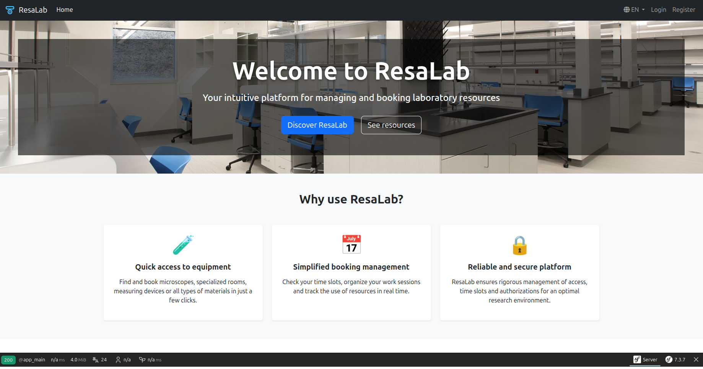

#  ResaLab - Application de Gestion de Réservation de Ressources

Bienvenue dans le projet `ResaLab`, une application de démonstration construite avec Symfony 7 pour illustrer des concepts fondamentaux et avancés du framework.

`ResaLab` est une plateforme intuitive pour la gestion et la réservation de ressources de laboratoire, conçue pour être un support technique de haute qualité.



---

## 🚀 Démarrage Rapide du Projet

Suivez ces étapes pour lancer l'application `ResaLab` sur votre machine.

### Prérequis

Assurez-vous d'avoir installé les outils suivants :

*   **PHP 8.2+**
*   **Docker & Docker Compose :** Pour l'environnement de développement isolé (base de données, serveur de mails).
*   **Symfony CLI :** L'outil en ligne de commande de Symfony.
*   **Composer :** Le gestionnaire de dépendances pour PHP.

### Lancement

1.  **Clonez le dépôt GitHub :**
    ```bash
    git clone https://github.com/XanderSpartacus/resalab-project
    cd resalab-project
    ```

2.  **Démarrez l'environnement Docker :**
    Cette commande va lancer les conteneurs PostgreSQL (base de données) et Mailpit (serveur de mails pour le développement).
    ```bash
    docker compose up -d
    ```

3.  **Installez les dépendances Composer :**
    ```bash
    composer install
    ```

4.  **Lancez le serveur web Symfony :**
    ```bash
    symfony serve
    ```
    L'application sera accessible à l'adresse indiquée par Symfony CLI (généralement `https://127.0.0.1:8000`).

5.  **Lancez le Worker Messenger (dans un nouveau terminal) :**
    Pour que les emails soient envoyés et les messages asynchrones traités, lancez cette commande dans un terminal séparé.
    ```bash
    php bin/console messenger:consume async
    ```

6.  **Créez et migrez la base de données :**
    ```bash
    php bin/console doctrine:database:create
    php bin/console doctrine:migrations:migrate
    ```

7.  **Chargez les données de démonstration (Fixtures) :**
    Pour peupler la base de données avec des utilisateurs, ressources et catégories fictifs.
    ```bash
    php bin/console doctrine:fixtures:load
    ```
    *(Répondez `yes` si Symfony vous demande de purger la base de données.)*

Félicitations ! Votre application `ResaLab` est maintenant prête et fonctionnelle.

---

## 🛠️ Commandes Utiles

Cette section récapitule les commandes essentielles pour interagir avec le projet.

### Docker & Environnement
*   `docker compose up -d` : Démarre les services en arrière-plan.
*   `docker compose stop` : Arrête les services.
*   `docker compose down` : Arrête et supprime les conteneurs.
*   `docker ps` : Liste les conteneurs en cours d'exécution.
*   `docker logs <nom_du_service>` : Affiche les logs d'un service (ex: `docker logs resalab-project-mailpit-1`).

**Accès aux services :**
*   **Application :** `https://127.0.0.1:8000` (via `symfony serve`)
*   **Serveur de mails (Mailpit) :** `http://localhost:8025`
*   **Base de données (PostgreSQL) :** Port `5432`, utilisateur `resalab_user`, mot de passe `password`, base `resalab_db`.

### Base de Données (Doctrine ORM)
*   `php bin/console doctrine:migrations:migrate` : Applique les migrations.
*   `php bin/console make:migration` : Génère une nouvelle migration.
*   `php bin/console doctrine:fixtures:load` : Charge les jeux de données.

### Déploiement
*   `php bin/console asset-map:compile` : Compile et copie les assets (CSS, JS) dans le dossier `public/assets` pour la production. Indispensable pour éviter les erreurs 404 sur les assets en environnement `prod`.

### Cache
*   `php bin/console cache:clear` : Vide le cache de l'environnement actuel (`dev` par défaut).
*   `php bin/console cache:clear --env=prod` : Vide le cache de production.

### Débogage
*   `php bin/console debug:router` : Liste toutes les routes de l'application.
*   `php bin/console debug:autowiring` : Liste tous les services auto-injectables.

---

## 🏗️ Principales Technologies & Bundles

*   **Symfony 7.3** : Framework principal.
*   **Doctrine ORM** (`doctrine/doctrine-bundle`): Gestion de la base de données.
*   **Twig** (`symfony/twig-bundle`): Moteur de templates.
*   **Symfony Security** (`symfony/security-bundle`): Authentification et gestion des droits.
*   **Symfony Form & Validator** : Création et validation de formulaires.
*   **AssetMapper** (`symfony/asset-mapper`): Gestion des assets sans build step complexe.
*   **Stimulus** (`symfony/stimulus-bundle`): Framework JavaScript pour l'interactivité.
*   **Turbo** (`symfony/ux-turbo`): Pour une navigation rapide, sans rechargement de page complet.
*   **Symfony Mailer** (`symfony/mailer`): Envoi d'e-mails.
*   **Symfony MakerBundle** : Outil de génération de code.
*   **Doctrine Fixtures** (`doctrine/doctrine-fixtures-bundle`): Pour charger des données de test.
*   **Symfony Web Profiler** (`symfony/web-profiler-bundle`): Barre d'outils de débogage.

---

## 📝 Licence

The MIT License (MIT)

Copyright (c) 2025 Yassine KHLOUFI

Permission is hereby granted, free of charge, to any person obtaining a copy
of this software and associated documentation files (the "Software"), to deal
in the Software without restriction, including without limitation the rights
to use, copy, modify, merge, publish, distribute, sublicense, and/or sell
copies of the Software, and to permit persons to whom the Software is
furnished to do so, subject to the following conditions:

The above copyright notice and this permission notice shall be included in all
copies or substantial portions of the Software.

THE SOFTWARE IS PROVIDED "AS IS", WITHOUT WARRANTY OF ANY KIND, EXPRESS OR
IMPLIED, INCLUDING BUT NOT LIMITED TO THE WARRANTIES OF MERCHANTABILITY,
FITNESS FOR A PARTICULAR PURPOSE AND NONINFRINGEMENT. IN NO EVENT SHALL THE
AUTHORS OR COPYRIGHT HOLDERS BE LIABLE FOR ANY CLAIM, DAMAGES OR OTHER
LIABILITY, WHETHER IN AN ACTION OF CONTRACT, TORT OR OTHERWISE, ARISING FROM,
OUT OF OR IN CONNECTION WITH THE SOFTWARE OR THE USE OR OTHER DEALINGS IN THE
SOFTWARE.
